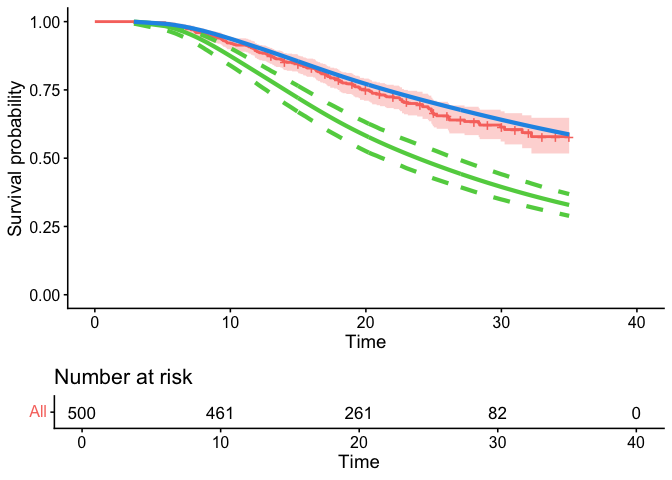
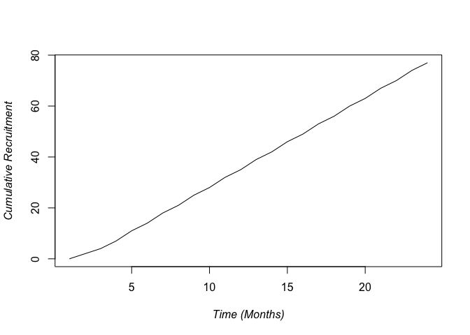
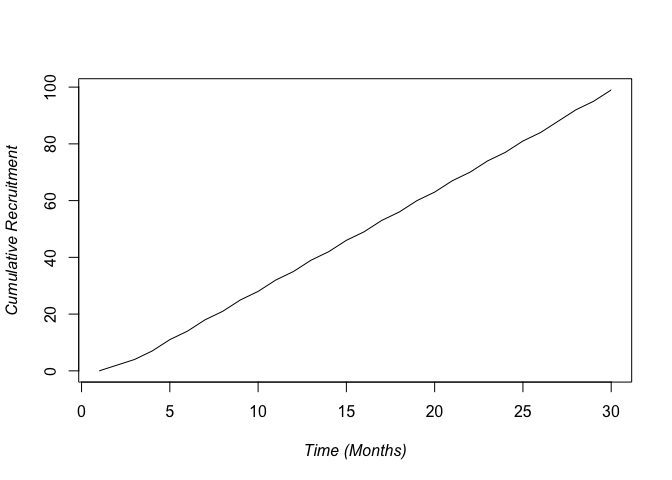

<!-- README.md is generated from README.Rmd. Please edit that file -->

# pscDesign

<!-- badges: start -->

[](https://CRAN.R-project.org/package=pscDesign)
[](https://github.com/richJJackson/pscDesign/actions/workflows/R-CMD-check.yaml)
<!-- badges: end -->

The pscDesign packaged is developted to aid in the design of clinical
trials using personalised synthetic controls

## Installation

You can install the development version of pscDesign from
[GitHub](https://github.com/richjjackson/pscDesign) with:

``` r
# install.packages("devtools")
devtools::install_github("richJJackson/pscDesign")
```

## Example

This is a basic example which shows you how to solve a common problem:

``` r
library(pscDesign)
#> Loading required package: psc
#> Loading required package: survival
#> Loading required package: ggplot2
#> 
#> Attaching package: 'pscDesign'
#> The following object is masked from 'package:psc':
#> 
#>     gemCFM
```

## Syntheticall Controlled Trial Design

We now walk through the steps required to use the pscDesign function. To
do this we make use of the gemCFM data

``` r
library(pscDesign)
gemCFM <- pscDesign::gemCFM
#load("~/Documents/GitHub/pscDesign/Data/gemCFM.rda")
```

Before using the pscDesign() function to perform the simulation study,
we first ensure the CFM is compatible by simulating a single dataset
using the dataSim() function

``` r
simData <- dataSim(gemCFM,n0=0,n1=500,beta=log(0.5),fuTime=12,recTime=24)
psc.ex <- pscfit(gemCFM,simData)
```

We can evaluate the fit of this example using the summary and plot()
functions

``` r
summary(psc.ex)
#> Counterfactual Model (CFM): 
#> A model of class 'flexsurvreg' 
#>  Fit with 5 internal knots
#> 
#> CFM Formula: 
#> Surv(time, cen) ~ LymphN + ResecM + Diff_Status + PostOpCA199
#> <environment: 0x13fb55cb8>
#> 
#> CFM Summary: 
#> Expected response for the outcome under the CFM:
#>     S     lo     hi  
#> 24.00  21.41  27.00  
#> 
#> Observed outcome from the Data Cohort:
#>          [,1]
#> median   NA  
#> 0.95LCL  NA  
#> 0.95UCL  NA  
#> 
#> MCMC Fit: 
#> Posterior Distribution obtaine with fit summary:
#>       variable     rhat         ess_bulk     ess_tail     mcse_mean  
#> [1,]  beta_1       1.000078     1222.439     1260.249     0.002611558
#> 
#> Summary: 
#> Posterior Distribution for beta:Call:
#>  CFM model + beta
#> 
#> Coefficients:
#>            variable    mean        sd          median      q5        
#> posterior  beta_1      -0.7362122  0.09148957  -0.7346159  -0.8890737
#>            q95       
#> posterior  -0.5839478
plot(psc.ex)
#>            variable    mean        sd          median      q5        
#> posterior  beta_1      -0.7362122  0.09148957  -0.7346159  -0.8890737
#>            q95       
#> posterior  -0.5839478
#> Warning: Using `size` aesthetic for lines was deprecated in ggplot2 3.4.0.
#> ℹ Please use `linewidth` instead.
#> ℹ The deprecated feature was likely used in the ggpubr package.
#>   Please report the issue at <https://github.com/kassambara/ggpubr/issues>.
#> This warning is displayed once every 8 hours.
#> Call `lifecycle::last_lifecycle_warnings()` to see where this warning was
#> generated.
#> Ignoring unknown labels:
#> • colour : "Strata"
```



### Single Arm Trial Design

We first demonstrate the impact of a single arm trial design. We design
the study in 2-steps. Initially we provide a estimated monthly
recruitment rate.

#### recruitment forecast

This is based on 4 sites recruiting at an average rate of 0.88
patients/site/month.  
Sites will themselves open at a rate of 1 site/month and a maximum
recruitment time of 24 months is set. This gives a total sample size of
70 patients.

``` r
N.site <- 4
rpm <- 0.88
open.rate <- 1
recTime <- 24
recF <- recForcast(N.site,rpm,open.rate,Max.Time=recTime)  
```



#### Power estimates

We run the pscDesign function using the ‘rec=recF’ option to include
these recruitment estimates. Other parameters show we are interested in
a ningle arm study (n=0) looking for a HR = 0.7 (beta=log(0.7)). We
allow for a follow-up period of 12 months and in this example use only
10 simulations (you will want more but we keep this small to keep the
processing speed down). We limit the pscfit function to use 750 MCMC
iteration and allow the first 250 to act as a burn in.

``` r
pscDes_singArm <- pscDesign(CFM=gemCFM,n0=0,n1=70,beta=log(0.7),rec=recF,
                                fuTime=12,nsim=10,nsim.psc=750,burn.psc=250,
                                bound=0,direction="greater",
                                alpha_eval=c(0.05,0.1,0.15,0.2))
```

We view the results below showing the esitmated number of events,
posterior mean and posterior standard deviation. Also given are the
power estiamtes for a range of alpha levels.

``` r
pscDes_singArm
#> [[1]]
#>         ne    post_mn    post_sd 
#> 29.8000000 -0.4292838  0.1773080 
#> 
#> [[2]]
#>   alpha_eval pwrEst
#> 1       0.05    0.9
#> 2       0.10    0.9
#> 3       0.15    0.9
#> 4       0.20    0.9
```

### Randomised Trial Design

In a randomised trial design we extend the example to allow 30 patients
onto the control arm as well as 70 on the experimental.

#### recruitment forecast

Given the extra patients required we extend recruitment by a period of 6
months.

``` r
N.site <- 4
rpm <- 0.88
open.rate <- 1
recTime <- 30
recF <- recForcast(N.site,rpm,open.rate,Max.Time=recTime)  #100 patients over 30 months
```



We ammend the pscDesign() function allowing for control patients (n=30)

``` r
pscDes_rand <- pscDesign(CFM=gemCFM,n0=30,n1=70,beta=log(0.7),rec=recF,
                                fuTime=12,nsim=5,nsim.psc=750,burn.psc=250,
                                bound=0,direction="greater",
                                alpha_eval=c(0.05,0.1,0.15,0.2))
```

The results of the design given below now include estimates of the
efficacy parameter using Personalised Synthetic Controls, Direct
Estimation (e.g. using only the information in the trial) and the
‘posterior’ estimate which combines these two efficacy estimates

``` r
pscDes_rand
#> [[1]]
#>         ne     mn_psc     sd_psc  mn_direct  sd_direct    post_mn    post_sd 
#> 42.6000000 -0.5513589  0.1885672 -0.5786859  0.3164008 -0.5630789  0.1614599 
#> 
#> [[2]]
#>   alpha_eval pwrEst
#> 1       0.05      1
#> 2       0.10      1
#> 3       0.15      1
#> 4       0.20      1
```
